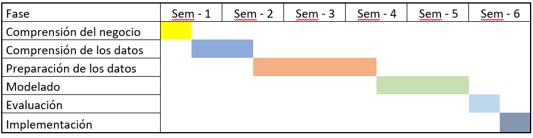

```{r Inicio, message=FALSE, warning=FALSE, include=FALSE}
knitr::opts_chunk$set(echo = TRUE, warning = FALSE)
knitr::opts_knit$set(root.dir = rprojroot::find_rstudio_root_file())
```

## 1. Entendimiento del caso de negocio y planificación del trabajo

**Planteo del problema**  
Rest-on es una guía turística que está armando en su web una sección de restoranes, que sirva para asesorar a sus clientes en las características y calidad de los restoranes. A estos efectos, los contratan a ustedes para apoyarlos en los algoritmos de soporte de su web, con dos objetivos: 
* Poder recomendarles a sus clientes restoranes similares a los que han consultado
* Rankear a los restoranes, en términos relativos a los restoranes comparables. 
A estos efectos, cuenta con una base de datos de restoranes, a la cual se puede acceder en el siguiente link: https://archive.ics.uci.edu/ml/datasets/Restaurant+%26+consumer+data

### 1.1 Discuta el desafío planteado en términos de la importancia que tiene para una empresa cualquiera y para Rest-on en particular
Ofrecer recomendaciones que generan valor para los clientes es un objetivo para Rest-ON. No es solo recomendar una opción al cliente, sino que esta desarrolle una conexión con la marca y los clientes vean en la empresa un asesoramiento fundamentado.  Por tanto, es objetivo realizar un este análisis permitiendo que los clientes no solo encuentren lo que están buscando, sino que se identifiquen con el servicio. 
Este desafio está presente en todas aquellas empresas en que su valor de negocio esté vinculado con la fidelidad de los clientes que trabajan con la marca.  

### 1.2	Identifique conceptual y técnicamente qué tipo de modelos serían necesarios para atender este problema  
Para ofrecer una información que genere valor para el cliente se deben clasificar correctamente los restaurantes a partir de las características que estos poseen y los servicios que ofrece, también se puede tener en cuenta las características propias de los usuarios que visitan los restaurantes que permita realizar una segmentación en función de las características de los usuarios. 
Todo dependerá del análisis del negocio detallando donde se identifique las variables que pueden formar parte de la segmentación de los restaurantes y poder ofrecer una calidad del servicio superior a los turistas que vienen a recibir la experiencia de Rest-ON.

### 1.3	Plantee hipótesis respecto a qué dimensiones de análisis y variables pueden ser relevantes para lograr el objetivo

Analizando el modelo de negocio de la empresa planteamos como hipótesis que:
Para ofrecer mejores recomendaciones es necesario conocer las características de los restaurantes, entender que tipos de cliente asisten y establecer las peculiaridades de la comida que ofrecen  

**Dimensiones propuestas:**  
* Características de los restaurantes  
* Características de la comida  
* Datos de los clientes que concurren  

**Como variables dentro de cada dimensión identificamos las siguientes:**  
* Características de la comida: Esta dimensión abarca las particularidades de la comida respecto al tipo de menú, la forma en que se sirve, restricciones alimenticias, entre otros.  
* Características de los restaurantes – aquí se recoge la tipología del restaurante, en relación a aspectos operativos y físicos, tales como ubicación, disponibilidad de estacionamiento, medios de pagos aceptados, y otras cualidades que lo hagan atractivo.  
* Datos del cliente: Deberíamos conocer el perfil y las costumbres de los clientes que concurren al restaurante, que nos permita clasificarlos teniendo en cuenta características de los clientes que concurren y en qué modo lo hacen.  
*Ejemplo: Si es con familia, o amigos, si prefieren un ambiente relajado, etc*

### 1.4 Identifique, en base a lo anterior, qué tipo de datos precisaría obtener para llevar a cabo este trabajo

> Ver anexo *Datos Complementarios.xlsx* la pestaña **Varibles Propuestas**

### 1.5	Arme un plan de trabajo, identificando las diferentes etapas y actividades para lograr el objetivo 

Se propone para el desarrollo de esta investigación utilizar la metodología CRISP–DM que abarca desde el entendimiento del negocio hasta el despliegue de la solución sin dejar de lado las tareas de gestión de proyectos que permiten el monitoreo y control del tiempo, costos y riesgos asociados.  
De acuerdo con la metodología CRISP-DM se proponen las siguientes fases:   

1. Comprensión del negocio  
2. Comprensión de los datos  
3. Preparación de los datos  
4. Modelado  
5. Evaluación  
6. Implementación  

**Comprensión del negocio:** El plan para esta fase consta de comprender el negocio y  los objetivos comerciales de la empresa. Adicionalmente abarcaremos tareas tales como describir el problema que se desea resolver, la naturaleza del negocio y el aporte que se desea obtener con el trabajo. 
Comprensión de los datos: Se realizará un análisis de todos los dataset, revisando las variables y cantidad de registros de cada uno de ellos, presencia de N/A, estructura de los datos, errores en los mismos y utilidad que aporta cada una de las variables para el objetivo del trabajo. 

**Preparación de los datos: **En función de los resultados obtenidos en la fase anterior trabajaremos en la transformación de los datos para obtener las variables en el formato adecuado, crear nuevas a partir de la transformación de las ya existentes, y corrección mediante alguna metodología de los registros con NA. 

**Modelado:** En esta etapa se evaluarán los modelos a utilizar para realizar el análisis de cluster de los restaurantes. Por la naturaleza del problema se tratará de un modelo no supervisado. Evaluaremos modelos aglomerativos y divisivos.
Evaluación: Se utilizarán técnicas como silueta y elbow para ajustar los modelos y verificar los resultados. 

**Implementación: **Por último se pondrá el modelo a disposición para ser utilizado evaluando la forma más eficiente de hacerlo.  
Si bien todas las etapas comentadas anteriormente se hacen en forma secuencial, el modelo prevé la posibilidad de regresar a una fase anterior para revisarla y retomar nuevamente el proceso.  

**Gestión de proyecto**   
Para la implementación del proyecto se realizará entre el equipo un control de toda la versión del proyecto y se generará un repositorio para el seguimiento y control de código. Utilizando buenas prácticas se reduce la posible generación de errores en los controles de cambio.Utilizaremos Github para realizar el seguimiento de las versiones de la documentación.   




### 1.6	¿Cómo será utilizado el resultado del trabajo por el cliente? 

El resultado o solución va a ser utilizado por la agencia turística para incluirlo en su motor de búsqueda y ofrecer un servicio que beneficie a sus usuarios, generando más volumen de visitas a su sitio y fidelizándolos. 

También será usado por los asesores de la empresa que utilizarán el sitio para ofrecer a los vacacionistas mejores recomendaciones según sus necesidades y las características de los restaurantes.  

Los restaurantes en la medida que este motor de búsqueda y recomendaciones tenga mayor difusión se beneficiarán por tener mayor publicidad y el perfil de clientes que se sienta más cómodo respecto la propuesta que ofrece.  

El usuario en la medida que el motor de búsqueda sea reconocido y fiable en cuanto a las recomendaciones podrá disfrutar de opciones más adecuadas a sus preferencias.   
 
### 1.7	En base a lo anterior, ¿Qué áreas se deberían involucrar en el proyecto y qué rol cumplirían?

Para la ejecución exitosa del proyecto tendrían que participar todas las áreas que estarán en el ciclo completo del proyecto, desde la definición hasta su puesta en producción y mantenimiento del proyecto. 

Entre las áreas identificadas están comercial, marketing y el área de soporte técnico que son quienes más conocen a los usuarios de la guía. Por otro lado el área de operaciones y IT al conocer como manejar la gestión de la empresa realizarán la captura y recopilación de los datos de los diferentes restaurantes. Finalmente, el área financiera deberá verificar los impactos económicos de las iniciativas y el equipo de Analistas de Datos para interactuar con los restantes interlocutores.

## 2. Extracción, Transformación o Carga de datos
### 2.1	Diseñe la estructura de tabla datos analítica: ¿qué va a ser cada fila? cuáles van a ser las columnas.  

La tabla analítica resultante de esta etapa contará de ID de restaurantes en las filas y variables en las columnas.

> Ver anexo *Datos complementarios.xlsx* la pestaña **Tabla**

### 2.2	¿Cómo se construye cada una de las variables en la tabla de datos? ¿De qué tablas surge y qué transformaciones de datos son necesarias?

En el archivo adjunto “Datos complementarios.xlsx” se especifican las características de las variables seleccionadas, cuál será la fuente de información y que transformación se le hará a cada una.  

> Ver anexo *Datos complementarios.xlsx* la pestaña **Tabla**

### 2.3	Construya la tabla de datos analíticas en base a la especificación anterior

Finalmente se ensamblan todas las variable en la tabla analítica a partir de los ID de restaurantes de la tabla de geoplaces. Esto es debido a que a pesar de que tiene notoriamente menos registros que los restantes dataset, contiene información muy relevante al momento de realizar el cluster, por lo que decidimos reducir la cantidad de restaurantes en pos de enriquecer el análisis.  
Se trabaja en la corrección de los registros con NA en las variables donde están presentes definiéndolos con un valor diferente a los existentes de forma de tenerlos identificados. 

A modo aclaratorio comentamos que los dataset de los usuarios no fueron utilizados ya que no están identificados como usuarios de los diferentes  restaurantes por lo que no aportan información relevante para el perfil de clientes.

Adicionalmente las caracteristicas contenidas en los mismos como ser medios de pagos y perfil de clientes ya esta presente en los datasets de los restaurantes.

A continuación se detalla todo el proceso de ETL realizado para cada una de las variables.

**Preparación del entrono de trabajo**  
Se cargan todas las librerías a ser utilizadas
```{r Librerias, message=FALSE, warning=FALSE, include=FALSE}
library(plyr) # OK
library(dplyr) # OK
library(Hmisc) # OK
library(cluster) # OK
# library(tidyverse)
# library(modelr)
library(funModeling) #OK
library(ggplot2)
library(ggcorrplot) # OK
# library(MASS)
# library(GGally)
# library(simstudy)
# library(foreign)
# library(feather)
# library(data.table)
# library(jtools)
# library(purrr)
library(tidyr) # OK
# library(XML)
# library(xml2)
# library(jsonlite)
# library(rjson)
# library(stringi)
# library(here)
library(PCAmixdata) #OK
library(psych) # OK
library(factoextra)
library(fpc) #OK
#Distancias Geograficas
library(sp)
# library(magrittr)

#Se carga funciones utilizadas
source("Utility/tablaresumen.R")

#Se establece la semilla utilizada en proyecto
set.seed(123)
```

#### 2.1 - Transformación de datos de ubicación

Para analizar las distancias gegráficas de los restaurantes se analiza la fuente de datos geoplaces2.csv que tiene un 21 variables para analizar. A continuación se muestran las carateristicas de las vaiables, tipos de datos y framento de valores a partir de la función *srt*

```{r Ubicación: geoplaces2.csv }
geoplaces <- read.csv ("Dataset/geoplaces2.csv", sep = ',')
str(geoplaces)
```
Las primeras variables dentro de este set de datos que será analizadas son latitud(latitude) y longitud(longitude). A continuación se grafican los puntos para identificar como están distribuidas. 
```{r Plot Coordenadas}
geoCoord <- geoplaces[,1:3]
plot(geoCoord[,2:3])
```

Analizando como se gráfica las coordenadas podemos plantear que los restaurantes estan separado en 3 cuidades diferentes. Visualmente se identificicaron los punto de referencias aproximados y se contrastaron con su ubicación en el mapa para seleccionar los puntos. Se debe definir las distancias entre los restaurantes y 3 puntos de referencia para establecer un marco comparativo entre las posiciones de los resutantes y los puntos de referencia.Los puntos de referencia elegidos arbitrariamente fueron:
22.156925, -100.985634 (San Luis Potosí)
18.924490, -99.221556 (Morelos)
23.732142, -99.148336 (Victoria.Tamaulipas)

```{r Distancias Ciudades}
#Creando los puntos de referencia
point1 <- matrix(c(22.156925,-100.985634),ncol=2)
point2 <- matrix(c(18.924490,-99.221556),ncol=2)
point3 <- matrix(c(23.732142,-99.148336),ncol=2)

#Convertir a matrix las coordenadas
mtxPoints <- data.matrix(geoCoord[,2:3])

#Calculando las distancias
distPoint1 <- t(spDists(point1, mtxPoints, longlat = TRUE))
distPoint2 <- t(spDists(point2, mtxPoints, longlat = TRUE))
distPoint3 <- t(spDists(point3, mtxPoints, longlat = TRUE))

#Creando dataframe con todos los resultados
dfDistance <- data.frame(placeID=geoplaces$placeID,distPoint1=distPoint1,distPoint2=distPoint2,distPoint3 = distPoint3)

#Obtener el index del valor mínimo que representa la ciudad permitiendo agruparlas
for (i in seq(nrow(dfDistance))) {
  pCoord <- c(dfDistance$distPoint1[i],dfDistance$distPoint2[i],dfDistance$distPoint3[i])
  dfDistance$classCity[i] <- if(as.numeric(which.min(pCoord)) == 1) {"A"} else if (as.numeric(which.min(pCoord)) == 2) {"B"} else "C"
}
head(dfDistance)
```

Entre los datos identificados en la fuente de datos geoplaces2.csv se encuentra la variable smoking_area la cual fue analizada e identificamos los siguientes valores únicos: none, not permitted,only at bar,permitted,section). Vamos a transformar esta variable en lógica para establecer si el restaurante permite o no fumar bajo ciertas condiciones. Se realizá un conversión a valores True para only_at_bar, permitted, section and False para los demás
```{r ¿Fumadores? isSmoking}
# Se carga la variable a analizar.
smokingPlace <- geoplaces[,c("placeID","smoking_area")]
levels(smokingPlace$smoking_area)
smokingPlace$smoking_area <- tolower(smokingPlace$smoking_area)

#Se identifica si el restaurante entra o no en la clasificación de fumadores.
for (i in seq(nrow(smokingPlace))) {
  smokingPlace$isSmoking[i] <- if(smokingPlace$smoking_area[i] == "only at bar"
                           || smokingPlace$smoking_area[i] == "permitted"
                           || smokingPlace$smoking_area[i] == "section") T else F
}

smokingPlace$smoking_area <- NULL

# Se muestran los primero 10 registros
head(smokingPlace,10)
```

*Analisis de los tipos de comida

Analizamos la variable Rcuisine de la base chefmozcuisine.csv donde se identifica 59 tipos de comidas distribuida entre todos los restaurantes. Un restaurante puede tener varios tipos de comida. A continuación se muestra el resumen de los datos cargados y un ejemplo de 6 valores.

```{r Tpo Comida: chefmozcuisine.csv}
chefmozcuisine <- read.csv ("Dataset/chefmozcuisine.csv", sep = ',')
str(chefmozcuisine)
head(chefmozcuisine)
```
Se realiza una reclasifacion utilizando pareto para reducir la cantidad de factores.
```{r Tpo comida: Distribución de frecuencia}
head(freq(chefmozcuisine, "Rcuisine"), 20)

cuisine_freq = freq(chefmozcuisine, "Rcuisine", plot = F)

chefmozcuisineFrc <- chefmozcuisine
chefmozcuisineFrc$Rcuisine = ifelse(chefmozcuisineFrc$Rcuisine %in% cuisine_freq[1:17,'Rcuisine'], chefmozcuisineFrc$Rcuisine, 'other')
freq(chefmozcuisineFrc, 'Rcuisine')

```
Un corte razonable sería a partir del 80% de los datos, pero esto implicaria quedarnos con 17 variables (las transformaremos en variables debido a que los restaurantes en general aplican a más de un tipo de comida por lo que tienen más de una fila para cada ID). Por otra parte observamos que existen varios tipos de comidas similares entre ellos, por lo que decidimos agruparlos generando una reclasificación para quedarnos con menos variables.

```{r Tpo Comida: Tipos}
#Grupos de comidas
chefmozcuisineAgg <- read.csv ("Dataset/Cuisine_agrupado.csv", sep = ';')
names(chefmozcuisineAgg)[2] <- "TypeCuisine"
# a continuación se unen ambas tablas conservando todas las filas del dataset original y agregando
# la columna con la nueva clasificación.
chefmozcuisineClass <- left_join(chefmozcuisine,chefmozcuisineAgg, by="Rcuisine")

# adicionalmente se elimina la columna con la clasificacion anterior y todas las filas que quedaron
# con igual clasificacion para el mismo ID
chefmozcuisineClass <- unique(chefmozcuisineClass[,-2])
chefmozcuisineClass <- 
  
# luego de correr los modelos detectamos que al poner como variables los tipos de comida, todos los restaurantes que aparecían con NA por no tener ese tipo de comida y posteriormente pasarlos a "Otros" se clusterizaron juntos debido a la alta frecuencia del atributo. Por tal razón decidimos seguir trabajando en agruparlos para no perder información y transformarlos en una variable única. Luego de este trabajo solo 5 restaurantes perdieron un tipo de comida y en varios casos el segundo tipo era "otro" por lo que tampoco se perdio información relevante.   
chefmozcuisineClass[!duplicated(chefmozcuisineClass[,c("placeID")]),]

head(chefmozcuisineClass, 10)
str(chefmozcuisineClass)
```
A partir de analisis anterior consideramos que aporta información de negocio determinar la cantidad de tipos de comida que ofrecen los restaurantes partiendo de la base que a mayor cantidad de ofertas permite un publico mas variado. Para esto utilizamos el dataset original en lugar del agrupado.
```{r CREATE Tpo Comida: Cantidad Comida}
chefmozcuisineCont <-chefmozcuisine%>%
                      group_by(placeID)%>%
                      count(placeID)

names(chefmozcuisineCont)[2] <- "foodCount"
head(chefmozcuisineCont)
```


Se analizan los días de atención de los restaurantes. Se concluye que no aporta información relevante porque más del 99% tiene atención los 7 días de la semana, por lo que se decide eliminar la variable del análsis.

```{r Dias Atencion}
# chefmozhours4_mod <- read.csv ("Dataset/chefmozhours4_modificado.csv", sep = ',')
# str(chefmozhours4_mod)
# #Levantar datos de dias de atencion y guardar
# #
# 
# chefmozhours4_mod$Days1 <- ifelse(chefmozhours4_mod$Days1 == "Mon", 1, (chefmozhours4_mod$Days1))
# 
# # se eliminan las columnas con los restantes dias de la semana (tue-fri) y las filas repetidas
# 
# chefmozhours4_mod <- unique(chefmozhours4_mod[,-3:-6])
# chefmozhours4_mod1 <- tidyr::spread(data = chefmozhours4_mod, key = Days1, value = Days1)
# chefmozhours4_mod1[,2:4] <- ifelse(chefmozhours4_mod1[,2:4] == "NA" , F , T)
# names(chefmozhours4_mod1) <- c("placeID", "L-V", "S", "D")
```

Otras de las variable a analizar es si tiene parking o no el restaurante. Cuando se carga los datos se identificaron 7 factores donde se distribuyen los datos. En ese caso se consideró crear una nueva variable logica donde se guarde TRUE cuando sean los valores fee, public, valet parking, validated parking, yes y FALSE cuando sea igual none o street.
```{r ¿Tiene Parking?}
#Levantar datos de parking y guardar
chefmozparking <- read.csv ("Dataset/chefmozparking.csv", sep = ',')

#Se identificaron los valores para el factor parking_lot
levels(chefmozparking$parking_lot)

#Cuando sea street se convierte a none porque se considera que no se clasifica como que tiene parqueo.
chefmozparking$parking_lot[chefmozparking$parking_lot == "street"] <- "none"

#Se crea una nueva variable parking_lot
chefmozparking$hasParking <- (ifelse(chefmozparking$parking_lot == "none", F, T))
chefmozparking$parking_lot <- NULL
head(chefmozparking)
str(chefmozparking)
```

Se analizaron los medios de pagos en la base de clientes "userpayment.csv" para identficar los mas usados y así cargar los mas identificativos del negocio. Se generó una columna para cada medio de pago y se determinó por restaurante TRUE O FALSE si tenia disponible este medio de pago.

```{r Medios Pagos: Tipos}
#Levantar datos de medios de pago aceptados y guardar
chefmozaccepts <- read.csv ("Dataset/chefmozaccepts.csv", sep = ',')

#Llevar todo a mayúscula y luego nos quedamos con los registros unicos
chefmozaccepts$Rpayment <- toupper(chefmozaccepts$Rpayment)
chefmozaccepts <- unique(chefmozaccepts)

#Genero el mismo set de datos para utilizar posteriormente
chefmozacceptsCant <- chefmozaccepts

 
# # Se normaliza todos los valores de medio de pago
# chefmozaccepts <- tidyr::spread(data = chefmozaccepts, key = Rpayment, value = Rpayment)
# print(colnames(chefmozaccepts))
# 
# #Seleccionamos las columnas que mantendremos
# varsToKeep <- c("placeID",  "AMERICAN_EXPRESS", "BANK_DEBIT_CARDS", "CASH", "MASTERCARD-EUROCARD", "VISA")
# chefmozaccepts <- chefmozaccepts[,varsToKeep]
# chefmozaccepts[,2:6] <- ifelse(is.na(chefmozaccepts[,2:6]) == T , F , T)
# head(chefmozaccepts, 10)
```
Después de analizado los datos se identifica que los restaurantes tienen varias opciones de medios de pagos por tanto se considera relevante para el analisis contar la cantidad de opciones que tiene cada restaurante.

Se optó por agregar esta nueva variable y desestimar la apertura en un medio de pago como variable para evitar el aumento signiticativo de la cantidad de variables del dataset. 
```{r Medios Pagos: Cantidad}

# Se calcula la cantidad medios de pagos por cada restaurante
chefmozacceptsCant <-chefmozacceptsCant%>%
                      group_by(placeID)%>%
                      count(placeID)

names(chefmozacceptsCant)[2] <- "payCount"
head(chefmozacceptsCant,10)
```

Ratings: Se cargaron las variables relacionadas a los rating de los restaurantes, comida y servicio.
```{r}
#Levantar ratings y guardar
ratings <- read.csv ("Dataset/rating_final.csv", sep = ',')
str(ratings)

#Se elimina la colmna de usuario
ratings <- ratings[,-1]

#Se calcula el promedio del rating realizado por todos los usuarios.
ratings <- aggregate(ratings[,2:4], list(ratings$placeID), mean)
names(ratings) <- c("placeID", "rating", "foodRating", "serviceRating")

head(ratings)
```
Se cargan las variables a analizar dentro de geoplaces:

```{r Otros atributos geoplaces}
otherAttributes <- geoplaces[,c("placeID","area","franchise","Rambience","price","accessibility","dress_code","alcohol")]
str(otherAttributes)

#Se convierte a lógica la variable "franchise" ya que sus valores son t y f
otherAttributes$franchise <- ifelse(toupper(otherAttributes$franchise) == "F",F,T)
head(otherAttributes,10)
```
### Unión de todos los dataset
Uniones entre las set de datos para generar la tabla principal de datos. Se toma los ID de los restaurantes presentes en geoplaces por ser los que poseen la información más relevante para el análisis:
```{r Union entre dataset}


allRestaurant <- left_join(x = dfDistance
                       ,y = smokingPlace
                       ,by = "placeID",
                       all = TRUE)

allRestaurant <- left_join(x = allRestaurant
                       ,y = chefmozcuisineCont
                       ,by = "placeID",
                       all = TRUE)

allRestaurant <- left_join(x = allRestaurant
                       ,y = chefmozcuisineClass
                       ,by = "placeID",
                       all = TRUE)

allRestaurant <- left_join(x = allRestaurant
                       ,y = chefmozparking
                       ,by = "placeID",
                       all = TRUE)

allRestaurant <- left_join(x = allRestaurant
                       ,y = chefmozacceptsCant
                       ,by = "placeID",
                       all = TRUE)

allRestaurant <- left_join(x = allRestaurant
                       ,y = ratings
                       ,by = "placeID",
                       all = TRUE)

allRestaurant <- left_join(x = allRestaurant
                       ,y = otherAttributes
                       ,by = "placeID",
                       all = TRUE)
str(allRestaurant)
head(allRestaurant,20)
```
## 3.	Exploración y análisis descriptivo  
### 3.1	Realice un análisis descriptivo de la tabla de datos.
Se obtiene la tabla con las variables ya definidas y los datos corregidos habiendo chequeado la existencia de ceros y NA.    
### 3.2	¿Descarta a priori alguna variable a partir de este análisis?
Respecto al medio de pago decidimos reducir la cantidad de variables y quedarnos solo con la variable de cantidad.  Anteriormente también habíamos descartado la variable relativa a la disponibilidad de internet ya que si bien es relevante había muy pocos restaurantes que contaban con este registro de información. 
### 3.3	¿Puede sospechar qué variables serán útiles para el problema identificado?
Entendemos que variables relativas a la ubicación, tipos de comidas y precio serán importantes para el análisis. 
### 3.4	¿Es necesario tomar alguna decisión respecto al universo o a la exclusión de valores atípicos?

Para las variables categóricas no existen datos atípicos ya que la única que presentaba observaciones de este tipo era la de tipos de comida y la reclasificamos reduciendo el número de niveles. 
Para las variables numéricas analizamos los outliers a partir de la distancia de Mahalanobis, y los monitorearemos una vez que tengamos los resultados de la clusterización. 


```{r Analisis de NA,Ceros,INF..}
funModeling::df_status(allRestaurant)
```
### 3.1 Tratamiento a valores NAs, Ceros y tipos de datos

Identificamos que los valores isSmoking y franchise, hasParking son valores logicos pero no tienen NA pero los demas si deben ser transformados. Decidimos comvertir las variables logcias con presencia de Na en variables categoricas (Factor)  y se agregará una nueva clasificación "otros" donde se agrupen los valores faltantes.
Todos los valores de Cantidad de comida (foodCount) con valores Na seran convertidos a 10 buscando un valor alejado a los registros existentes.
```{r Na Ceros y Tpos datos}
#Convertir los Na de las variables numericas de cantidad de comidas y medios de pagos ofrecidos en 10 
varsNumeric = c("foodCount", "payCount")
allRestaurant = allRestaurant %>% mutate_at(.vars=varsNumeric, .funs = funs(ifelse(is.na(.), 10, .)))

# se lo identifica como "SIN DATO" ya que existe un atributo "Otros" como residual en la agrupación por tipo de comida. 
allRestaurant$TypeCuisine <- as.character(allRestaurant$TypeCuisine)
allRestaurant[is.na(allRestaurant)] = "SIN DATO"

#Dtermino las variables definidas como caracter y las convierto a factor
varLog <- unlist(lapply(allRestaurant, is.character))
allRestaurant[,varLog] <- data.frame(sapply(allRestaurant[,varLog],as.factor))

#Esta variable tiene el 83% de valores nulos por tanto de descarta del análisis
allRestaurant$franchise <- NULL

#Se muestra el resuen del estatus de los datos
funModeling::df_status(allRestaurant)
```
Despues de la transformación se mantienen las 130 observaciones con sus transformaciones aplicadas.

```{r Matriz Correlacion}
# calculamos la matriz de correlacion 
matriz <- allRestaurant  %>%
  na.omit() %>%
  select_if(is.numeric)%>%
  as.matrix() %>%
  rcorr

# graficamosla matriz de correlacion
is.na(allRestaurant) <- sapply(allRestaurant, is.infinite)
allRestaurant[is.na(allRestaurant)] <- 0

 allRestaurant %>%
   na.omit() %>%
   select_if(is.numeric) %>%
   cor %>%
   ggcorrplot(type = "lower", ggtheme = theme_minimal, colors = c("#6D9EC1","white","#E46726"),
              show.diag = T,
              lab = T, lab_size = 3,
              title = "Correlation Matrix",
              legend.title = "Correlation Value",
              outline.color = "white",
              hc.order = T)
```

Se grafica la correlación entre las variables numéricas. Se observa alta correlación entre las variables de distancias entre sí y tambien entre las que refieren al rating,lo cual tiene sentido. 

```{r Correlacion entre variables Num}
varNun <- which(sapply(allRestaurant,is.numeric))
allRestNum <- allRestaurant[,varNun]
pairs.panels(allRestNum, stars = TRUE)
```

Identificamos las observaciones que tienen outliers. Decidimos mantenerlas en el dataset para al finaizar observar cual fue su comportamiento. En la grafica siguiente se visualiza que la observación 129 tiene presencia de outliers.

```{r outliers}
#Identificando outliers (Variables númericas)
md <- mahalanobis(allRestNum, center = colMeans(allRestNum), cov = cov(allRestNum))
alpha <- .005
cutoff <- (qchisq(p = 1 - alpha, df = ncol(allRestNum)))
outliersMH <- which(md > cutoff)
outlierRest <- psych::outlier(allRestNum)
print(outliersMH)
```
### 3.2 PCAMix
Sea realiza la corrida del PCAMix que aplica para variables categoricar y numericas. El resultado nos arrojó que el 90% de la varianza se acumula en el componente 16.
```{r PCAMix}
# Separamos numéricas de factores
separacion <- splitmix(allRestaurant)
cuantitativas <- separacion$X.quanti
cualitativas <- separacion$X.quali
 
#PCAmix
restMixPCA <- PCAmix(cuantitativas, cualitativas, rename.level = TRUE, graph = FALSE, ndim = 31)
 
# Contribución a la varianza
restMixPCA$eig # el 90% de la varianza se acumula en el componente 18

#Se corre nuevamente para 18 dimensiones que es donde se acumula más del 90% de la varianza
restMixPCA <- PCAmix(cuantitativas, cualitativas, rename.level = TRUE, graph = FALSE, ndim = 18)

allRestScores <- data.frame(restMixPCA$scores.stand)
head(allRestScores)
```

### 3.2 Distancia de Gower

```{r Distancia de Gower allRestaurant, warning=FALSE}
dfGowerDist <- daisy(allRestaurant, metric = "gower")

#Generar el histograma dfGowerDist
hist(dfGowerDist, xlim = range(0.0,1.0), main = "Histograma de distancia de Gower - allRestaurant")
```

```{r Distancia de Gower PCAMix}
dfGowerDistPCA <- daisy(allRestScores, metric = "gower")

#Generar el histograma dfGowerDist
hist(dfGowerDistPCA, xlim = range(0.0,1.0), main = "Histograma de distancia de Gower - PCAMix")
```


## 4. Modelado y Evaluación
5.1	¿Qué variables pre-seleccionaría en base al análisis funcional y estadístico?
Una vez realizado el análisis anterior en relación a la transformación, eliminación y creación de nuevas variables decidimos quedarnos con todas las que se encuentran en la nueva tabla de datos

```{r}
str(allRestaurant)
```

### 4.2	Estime al menos dos modelos (usando diferentes algoritmos y/o variables), compárelos (en base a criterios estadísticos y funcionales) y seleccione el que entienda más adecuado.  
Utilizaremos los algoritmos de hclust como clustering aglomerativo y diana como clustering divisivo. 
Para calcular las distancias de Gower utilizamos Daisy ya que tenemos variables mixtas dentro de la tabla de datos.
Adicionalmente utilizaremos PCAmixed para calcular las mismas utilizando como dimensión la cantidad de componentes principales que acumulan el 90% de la varianza.

#### 4.2.1 Modelo - Diana

```{r Modelado: Diana}
clustDianaDiv <- diana(as.matrix(dfGowerDist),diss = TRUE, keep.diss = TRUE)
plot(clustDianaDiv, main = "Divisive")
```

**Análisis del Elbow**

```{r Evaluación: Diana - Elbow }
ggplot(data = data.frame(t(cstats.table(dfGowerDist, clustDianaDiv, 15))), 
  aes(x=cluster.number, y=within.cluster.ss)) + 
  geom_point()+
  geom_line()+
  ggtitle("Divisive clustering") +
  labs(x = "Num.of clusters", y = "Within clusters sum of squares (SS)") +
  theme(plot.title = element_text(hjust = 0.5))
```

**Análisis de la Silueta**  

En función de los resultados obtenidos en el codo anterior se determina K optimo igual 4
```{r Evaluación: Diana - Silueta }
clusDiana <- eclust(x = dfGowerDist, FUNcluster = "diana", k = 4, seed = 123,
                      hc_metric = "euclidean", nstart = 50, graph = FALSE)
fviz_silhouette(sil.obj = clusDiana, print.summary = TRUE, palette = "jco",
                ggtheme = theme_classic())
```

#### 4.2.2 Modelo: Diana con PCAMix

```{r Modelado: Diana (PCAMix)}
clustDianaPCAmix <- diana(as.matrix(dfGowerDistPCA),diss = TRUE, keep.diss = TRUE)
plot(clustDianaPCAmix, main = "Divisive")
```


**Análisis del Elbow**
```{r Evaluación: Diana - Elbow (PCAMinx) }
ggplot(data = data.frame(t(cstats.table(dfGowerDistPCA, clustDianaPCAmix, 15))), 
  aes(x=cluster.number, y=within.cluster.ss)) + 
  geom_point()+
  geom_line()+
  ggtitle("Divisive clustering") +
  labs(x = "Num.of clusters", y = "Within clusters sum of squares (SS)") +
  theme(plot.title = element_text(hjust = 0.5))
```

**Análisis de la Silueta**
En función de los resultados obtenidos en el codo anterior se determina K optimo igual 5
```{r Evaluación: Diana - Silueta (PCAMinx) }
clusDianaPCA <- eclust(x = dfGowerDistPCA, FUNcluster = "diana", k = 5, seed = 123,
                      hc_metric = "euclidean", nstart = 50, graph = FALSE)
fviz_silhouette(sil.obj = clusDianaPCA, print.summary = TRUE, palette = "jco",
                ggtheme = theme_classic())

```

#### 4.2.3 - Modelo: HCLUST
Modelo aglomerativo HCLUST

**HCLUST: Definición del método**
Realizaremos una corrida para cada metodo de hclust para identificar cual es el que tiene mayor numero de correlacion según los metodos posibles.
```{r Metodo HCLUST: Difinición del metodo}
# Metodo hclust (Hierarchical Agglomerative Clustering)
H1=hclust(dfGowerDist,method='average')
H2=hclust(dfGowerDist,method='complete')
H3=hclust(dfGowerDist,method='ward.D')
H4=hclust(dfGowerDist,method='single')

#Obteniendo el coheficiente de correlación para cada metodo
C1=cophenetic(H1)
C2=cophenetic(H2)
C3=cophenetic(H3)
C4=cophenetic(H4)


print(paste("method: average =",cor(dfGowerDist,C1)))
print(paste("method: complete =",cor(dfGowerDist,C2)))
print(paste("method: ward.D =",cor(dfGowerDist,C3)))
print(paste("method: single =",cor(dfGowerDist,C4)))

```
El metodo que con mayor cohefiente de correlacion fue el "average" con un 0.81 por tanto utilizaremos este metodo para el modelado.

**Modelo: hclust**
A partir del metodo definido en el epigrafe anterior se realiza la corrida del modelo
```{r Metodo: hclust}
clustHclustAggl <- hclust(dfGowerDist, method = "average")

plot(clustHclustAggl, main = "Aglomerativo, Método average")
```
**Análisis del Elbow**
```{r Evaluación: hclust - Elbow}
ggplot(data = data.frame(t(cstats.table(dfGowerDist, clustHclustAggl, 15))), 
  aes(x=cluster.number, y=within.cluster.ss)) + 
  geom_point()+
  geom_line()+
  ggtitle("Divisive clustering") +
  labs(x = "Num.of clusters", y = "Within clusters sum of squares (SS)") +
  theme(plot.title = element_text(hjust = 0.5))
```

**Análisis de la Silueta**
En función de los resultados obtenidos en el codo anterior se determina K optimo igual 4
```{r Evaluación: hclust - Silueta}
clusHclust <- eclust(x = dfGowerDist, FUNcluster = "hclust", k = 4, seed = 123,
                      hc_metric = "euclidean", nstart = 50, graph = FALSE)
fviz_silhouette(sil.obj = clusHclust, print.summary = TRUE, palette = "jco",
                ggtheme = theme_classic())
```


#### 4.2.4 Modelo: hclust (PCAMix)
A partir del metodo definido en el epígrafe anterior se realiza la corrida del modelo utilizando PCAMix
```{r Metodo Aglomerativo: hclust(PCAMix)}
clustHclustAgglPCA <- hclust(dfGowerDistPCA, method = "average")

plot(clustHclustAgglPCA, main = "Aglomerativo, Metodo Average")
```

**Análisis del Elbow**
```{r Evaluación: hclust - Elbow(PCAMix)}
ggplot(data = data.frame(t(cstats.table(dfGowerDistPCA, clustHclustAgglPCA, 15))), 
  aes(x=cluster.number, y=within.cluster.ss)) + 
  geom_point()+
  geom_line()+
  ggtitle("Divisive clustering") +
  labs(x = "Num.of clusters", y = "Within clusters sum of squares (SS)") +
  theme(plot.title = element_text(hjust = 0.5))
```

**Análisis de la Silueta**
En función de los resultados obtenidos en el codo anterior se determina K optimo igual 3
```{r Evaluación: hclust - Silueta (PCAMix)}
clusHclustPCA <- eclust(x = dfGowerDistPCA, FUNcluster = "hclust", k = 3, seed = 123,
                      hc_metric = "euclidean", nstart = 50, graph = FALSE)
fviz_silhouette(sil.obj = clusHclustPCA, print.summary = TRUE, palette = "jco",
                ggtheme = theme_classic())
```

### 4.3 Poda del arbol y asociación de cluster al dataset
A partir de los resultados de la silueta obtenidos para Diana y Hclust con y sin PCAMix concluimos que el mejor modelo es Diana sin PCAMix para K=4 obteniendo una silueta de 0.32.
```{r hclust: Cortar el arbol}
groups <- as.factor(cutree(clustDianaDiv, k=4))
summary(groups)
```
Se le agregara al dataset los nombres de los restaurantes
```{r Nombre: Restaurantes}
allRestaurant$cluster <- groups

restName <- geoplaces[,c("placeID","name")]
allRestaurant <- left_join(x = allRestaurant,y = restName,by = "placeID",all = TRUE)
head(allRestaurant)
```


### 4.3	Caracterice y describa los resultados a los cuales se arribaron en el caso anterior, desde el punto de vista del negocio.

Consideramos que por el resultado obtenido en el coeficiente de la silueta en base al K optimo resultante de la gráfica "elbow" no es lo suficientemente bueno. En la corrida anterior con los tipos de comidas abiertos como varibales obtuvimos un coeficiente de 0,45. Sin embargo a nivel de interpretación de resultados no vemos la utilidad de tener un cluster formado por registros con atributos "otros" cuando en realidad se trató de una correccion a los datos por la forma de exposición. 
Se muestra gráficamente dentro del dendograma la distribución de los 4 clusters  


```{r Evaluación: Diana Dendograma}
pltree(clustDianaDiv, hang=-1, cex = 0.6)
rect.hclust(clustDianaDiv, k = 4, border = 2:10)
```

```{r Ploteo de resultados}
# classCity
# foodCount
# TypeCuisine
# payCount
#cluster

plot(allRestaurant$classCity,allRestaurant$cluster)


# library(Lock5Data)
# plot(Happiness,LifeExpectancy,pch=19,col="red")
```
De la gráfica se concluye que los datos quedaron fuertemente clusterizados por la ciudad. Dentro de la ciudad A por el volumen de datos en relación a las dos restantes se formaron dos clusters. 
Acontinuacion se analizan los resutaltados de los clusters dentro de la ciudad A donde se visualiza la distribución de frecuencia de los distintos tipos de comida, observando que hubo cierta incidencia de esta variable en el modelo. Los "sin dato" que tienen una participación importante dentro de la distribución quedaron fuertemente concentrados en el cluster 3.
El outlier identificado en la posicion 129 pertenece a la ciudad B y quedó en el cluster 1 como el resto de los registros de esa ciudad


```{r}


cuidad_A = subset(allRestaurant,classCity == "A") 
cuisine_freq_A = freq(cuidad_A, "TypeCuisine")
cuidad_A_C2 = subset(cuidad_A,cluster== 2) 
cuisine_freq_A_C2 = freq(cuidad_A_C2, "TypeCuisine")
cuidad_A_C3 = subset(cuidad_A,cluster== 3) 
cuisine_freq_A_C2 = freq(cuidad_A_C3, "TypeCuisine")


```


Se exportan los datos del resultado en un archivo csv para ser cargado a la base de datos del sistema que gestiona la pagina web. 
```{r}
write.csv(allRestaurant,file="allRestaurantCSV.csv", row.names = FALSE)
```

### 5. Implementación

#### 5.1	¿Cómo entiende que el modelo podría ser utilizado por la web para cumplir el objetivo funcional?
En función de lo transmitido en el requerimiento el usuario debería ingresar el nombre de un restaurante y el sitio web le devolvería los restaurantes similares en función del análisis de clusters realizado 

#### 5.2	En base a lo anterior, ¿cómo debería ser la implementación de este modelo (estimación resultados en tiempo real, procesamiento batch, etc)?
Dentro de los tipos de implementación vistos en clase este modelo se podría clasificar como un análisis puntual que no precisa ser corrido con frecuencia. De todas formas sería importante cada cierto tiempo ir enriqueciendo las bases con información de los restaurantes y más aún cuando debimos trabajar solo con 130 registros por no contar con información relevante para los restantes.  

Implementaremos el modelo a conectándonos con una base de datos y actualizando los resultados de las predicciones por ID cada vez que hay una nueva corrida. Se guardarán los resultados en un csv se realizará una conexión a la base de datos y guardaremos las predicciones de los modelos en una tabla y columna específica.

#### 5.3	¿Cómo se podrían armar, usando los resultados de este modelo, los rankings de restoranes “en términos relativos” o “específicos a un grupo”? Si bien no es necesario realizar los desarrollos, identifique el proceso, actividades, variables a utilizar, etc y describa con el mayor detalle posible.
Los resultados del modelo se deberían mostrar en la web al ingresar el nombre de un restaurante por parte del usuario devolviendo todos los registros correspondientes a ese cluster. Entendemos que el cliente nos debería especificar el criterio para mostrar los restaurantes correspondientes a ese cluster pero sugerimos hacerlo por distancia de gower comenzado por la que tenga una menor, considerando que una menor distancia implica mayor similitud entre los mismos. 
Otro criterio de ordenamiento podría ser la ubicación geográfica, el tipo de comida recomendando en primer lugar los que ofrecen la misma comida que ingresó el usuario o por rating del restaurante.  

#### 5.4 ¿Qué ventaja tendría esto frente a usar un ranking general?
En el caso de la distancia de gower por ejemplo, la ventaja es que si no conocemos específicamente el atributo que según el usuario hace que un restaurante sea similar a otro, este parámetro contempla todas las variables mejorando la probabilidad de devolver uno similar considerando todas las variables contenidas en el dataset. 
#### 5.5	¿Cómo se podría evaluar el resultado (éxito) del trabajo?
Más allá de los métodos estadísticos como la silueta que se muestra en el desarrollo del trabajo, a nivel de negocio sería importante conocer la opinión del usuario luego de haber concurrido al restaurante recomendado de forma de conocer el grado de satisfacción de la recomendación.
